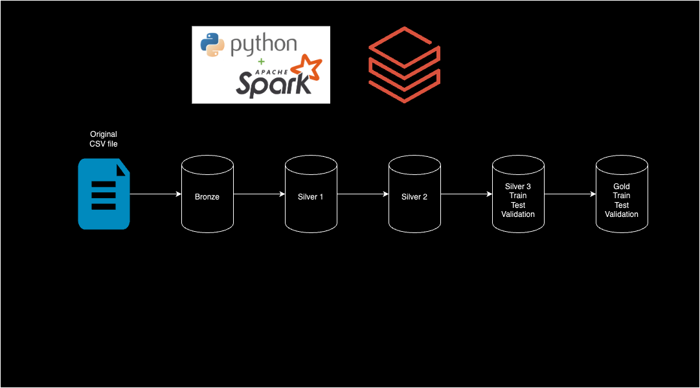

# README

1. Introduction
2. Resources
3. Challenge Scenario
4. Preparation
5. Challenge Tasks
    - Reading the Data
    - Medallion Architecture Implementation
        - Bronze Layer
        - Silver Layer
        - Gold Layer
    - SQL Queries
6. Transformation Exercise for Senior Data Engineer
    - Data Type Conversion
    - Data Normalization and Standardization
    - Data Partitioning and Sampling
7. Documentation and Presentation
8. How to Run and Test

## Introduction

This project demonstrates the implementation of the Medallion Architecture using the MH-CLD-2021-DS0001 SAMHSA dataset with PySpark. The goal is to showcase data engineering practices focusing on robustness and scalability.

## Resources

- DataBricks Free Trial
- Dataset: MH-CLD-2021-DS0001 SAMHSA dataset
- Dataset Source: MH-CLD-2021-DS0001-bndl-data-csv_v1.zip
- Data Dictionary: Dataset Documentation (link-to-dataset-documentation)

## Challenge Scenario

The task is to process and transform the given dataset using PySpark, implementing the Medallion Architecture to ensure data quality, robustness, and scalability. Ultimately, this is an ETL challenge that undergoes a Medallion Transformation before it can be consumed by stakeholders.

## Preparation

1. Start up a DataBricks workspace.
2. Use the provided dataset: MH-CLD-2021-DS0001-bndl-data-csv_v1.zip.
3. Review the dataset documentation.

## Challenge Tasks

### Medallion Architecture Implementation

#### Bronze Layer

The data is loaded with PySpark via the DBFS and transformed into Delta Live Table while it undergoes data and schema checks.

#### Silver Layer

The Bronze Layer has been loaded, and the following transformations have been performed as well as saved to their respective Delta Live Tables.
The tables and transformations made:
    Silver 1 - Data Type Conversion

    1. Converted the categorical variables to appropriate types.
    2. Ensured CASEID is stored as an integer.
    3. Converted the numeric variables to float types.
    4. Validated data types for all variables.

    Silver 2 - Data Normalization and Standardization

    1. Normalized the numeric variables using min-max scaling.
    2. Standardized the numeric variables using z-score normalization.
    3. Stored the normalized and standardized variables in new columns.

    Silver 3 - Data Partitioning and Sampling
    1. Split the dataset into training and testing sets based on demographic variables.
    2. Implement stratified sampling for training and testing sets.
    3. Create a validation set from the training set.
    4. Store dataset splits with appropriate naming conventions.

The silver tables have been partitioned for improved query performance. Schema checks were also implemented via delta live tables.

#### Gold Layer

The final gold layer undergoes more checks and is ready for business for the data stakeholders. This, too, undergoes schema checks, data checks, and improved query performance.

### Monitoring Each Layer

Logging has been implemented as decorators, and this pipeline has been designed to be orchestrated in DataBricks. The logging would be seen in the Spark UI and the scripts' outputs when running.

## How to Run and Test

1. Set up your Databricks environment.
2. Git clone this repo.
3. Run the `main.py` or the `main_notebook.py` file. The pipeline should run, and the data should be saved as Delta Live Tables.
